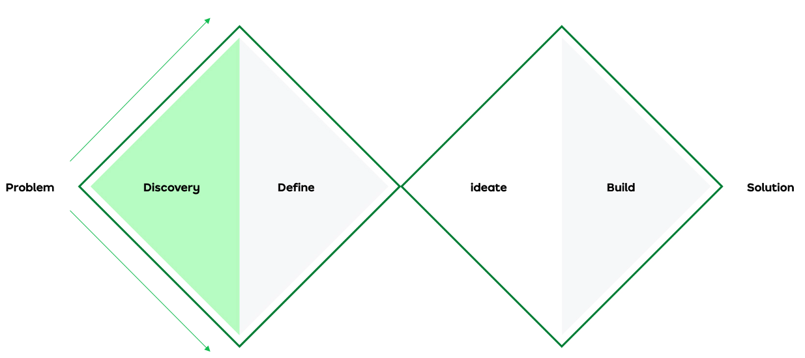

# Overview

This is intended to be a toolkit to help you define the most appropriate design process for your yourself, your team and the particular projects you're working on. 

This is not intended to be a definitive guide – you might need change the scope of each stage based on the need of the project, but you should still go through each stage.

## Our principles

## Design stages

1. [Discover the problem](/design-stages/define)
2. Explore ideas
3. Scope solutions
4. Create designs
5. Handover to build
6. Measure and learn

Each of these stages has different activities that could be done, either by yourself or in workshops. Factors such as the size, urgency, strategic importance and value of the project will determine which ones and how much you'll do.

## Project methodology

The project methodology used will also be a factor in deciding how you structure your project. These include:

* Waterfall
* Lean UX
* Agile